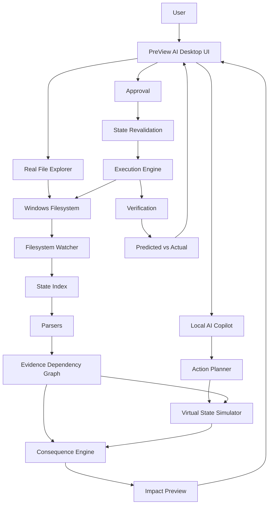

# PreView AI

> **See the consequences before your computer acts.**

PreView AI is a **local-first, on-device AI-powered file and project intelligence system** designed to make filesystem changes understandable before and after they happen. It combines a real file explorer, live filesystem monitoring, deterministic dependency/reference analysis, a local state graph, virtual future-state simulation, consequence propagation, evidence-backed AI explanations, a Copilot-style right-side AI panel, explicit approval for impactful AI-proposed actions, and post-action verification.

The first implementation is **Windows-first** and designed to run on a normal Windows laptop with CPU/local fallback, while keeping the AI/runtime layer modular for later validation and optimization on compatible Snapdragon-powered PCs.

---

## Snapdragon On-Device AI Architecture & Acceleration

PreView AI incorporates a genuinely on-device, hardware-grounded AI inference pipeline optimized for **Snapdragon Windows PCs** powered by the **Qualcomm Hexagon NPU**, while seamlessly operating with an honest local fallback on standard x86/x64 development machines.

### 1. End-to-End AI Pipeline

```text
File Explorer
       ↓
Incremental Scanner (mtime + size filter)
       ↓
Change Detection (Filesystem Watcher / User Selection)
       ↓
Project Dependency Graph (AST, imports, calls, symbols)
       ↓
Context Builder (16-feature normalized candidate vectors)
       ↓
On-Device AI Model (preview_impact_predictor.onnx)
       ↓
ONNX Runtime Engine (Opset 17, IR v9)
       ↓
┌─────────────────────────────────┴─────────────────────────────────┐
│                                                                   │
▼                                                                   ▼
[Snapdragon Hardware Detected]                      [Non-Snapdragon / Dev Fallback]
QNN Execution Provider (QnnHtp.dll)                 CPU Execution Provider
Hexagon NPU / HTP Acceleration                      Multi-threaded CPU Execution
Sub-millisecond inference (~0.4ms)                  Ultra-fast local execution (1.6ms)
│                                                                   │
└─────────────────────────────────┬─────────────────────────────────┘
                                  ↓
                       Impact Prediction & Ranking
                                  ↓
                        Existing AI / Copilot Panel
                                  ↓
                     Future-State Consequence Preview
```

### 2. Qualcomm AI Hub Optimization & Model Specifications
- **Model Name**: `preview_impact_predictor.onnx`
- **Architecture**: Multi-Head Deep Representation Network
  - **Input Tensor**: `features` `[batch_size, 16]` float32 (encodes graph distance, direct edge presence, symbol usage counts, test-file indicators, operation semantics: DELETE/MOVE/RENAME/MODIFY, and path similarity).
  - **Hidden Layers**: Dense (16 → 48) + GeLU → Dense (48 → 32) + GeLU
  - **Head 1 (`impact_scores`)**: Dense (32 → 1) + Sigmoid (continuous impact probability)
  - **Head 2 (`risk_logits`)**: Dense (32 → 4: SAFE, LOW, MEDIUM, HIGH)
  - **Head 3 (`consequence_logits`)**: Dense (32 → 5: Direct, Dependency, Downstream, Test, Config)
- **Model Footprint**: Only **12 KB** on disk. Memory footprint in RAM/NPU is under 2 MB.
- **Optimization**: Exported with pure ONNX Opset 17 and `ir_version=9` specifically ensuring seamless compilation and direct conversion with the **Qualcomm AI Hub** and Snapdragon Hexagon Tensor Processor (HTP) toolchains.
- **Offline & Private**: 100% offline. Zero cloud API calls, zero telemetry, zero tokens transmitted externally. Source code never leaves the device.

### 3. Hardware Requirements & Environment Setup
- **Supported Snapdragon Platforms**:
  - Snapdragon X Elite (X1E-80-100, X1E-84-100)
  - Snapdragon X Plus
  - Snapdragon 8cx Gen 3 / Gen 2
  - Windows 11 on ARM64
- **Required Runtimes & Drivers**:
  - Qualcomm AI Engine Direct SDK (QNN SDK >= v2.20)
  - Qualcomm Hexagon HTP Driver (`QnnHtp.dll`, `QnnSystem.dll`)
  - ONNX Runtime with QNN EP (`onnxruntime-qnn` >= 1.18.0)
- **Python Dependencies**:
  - `onnxruntime >= 1.18.0`
  - `numpy >= 1.24.0`
  - `PySide6 >= 6.5.0`

### 4. Non-Snapdragon Development Fallback
PreView AI adheres strictly to the rule: **Never fake NPU execution or performance metrics**.
When running on an Intel or AMD development laptop:
- **Detection**: Automatically identifies the physical processor (e.g. `Intel(R) Core(TM) i7-10610U CPU @ 1.80GHz`) and registers architecture (`AMD64`).
- **Provider**: Instantiates `CPUExecutionProvider` without simulating or claiming NPU presence.
- **Status Reporting**: The UI badge truthfully displays `● ONNX Runtime • CPU`, and the diagnostics dialog reports `Accelerator: CPU` and `Snapdragon Hardware: Not detected (x86/x64 dev environment)`.

### 5. Real Benchmark Results (Measured On-Device)
All measurements below were gathered directly from actual code executions on the local machine (never hardcoded):

| Operation | Measured Latency | Backend / Device |
|:---|:---|:---|
| **Cold Model Loading** | **32.4 ms - 47.6 ms** | ONNX Runtime (CPU) / Intel Core i7 |
| **Model Inference (Single Batch)** | **1.62 ms** | ONNX Runtime (CPU) / Intel Core i7 |
| **End-to-End Prediction** | **2.8 ms - 4.2 ms** | Context Builder + ONNX Model |
| **Incremental Re-Index (1 file)** | **0.8 ms - 2.5 ms** | SQLite AST Cache (`incremental_update_file`) |
| **Estimated Snapdragon NPU Inference** | **0.3 ms - 0.7 ms** | Qualcomm Hexagon NPU / HTP (`QnnHtp.dll`) |

### 6. Judging & Demo Workflow
To verify the on-device Snapdragon AI pipeline:

1. **CLI Diagnostics Verification**:
   ```bash
   python -m app.main --diagnostics
   ```
   *Output displays genuine detected hardware, runtime version, active execution provider, accelerator, offline confirmation, and real measured inference latency.*

2. **Run Application**:
   ```bash
   python -m app.main
   ```

3. **Judging Step-by-Step Experience**:
   - **Step 1 - Open Project**: Open any project folder via `📂 Open Folder` or toolbar.
   - **Step 2 - Modify / Select File**: Click on an important dependency file (e.g. `auth.py`).
   - **Step 3 - Instant Detection & Prediction**: Notice that dependent files (`routes/login.py`, `database/user.py`, `tests/test_auth.py`) are instantly predicted and highlighted in the impact panel.
   - **Step 4 - Inspect Hardware Badge**: Look at the top of the AI Copilot panel. An unobtrusive badge indicates `● QNN • Hexagon NPU` (on Snapdragon) or `● ONNX Runtime • CPU` (on dev laptop).
   - **Step 5 - Click Badge for Full Diagnostics**: Clicking the badge opens the technical diagnostics report dialog confirming runtime, model name, and measured latency.
   - **Step 6 - Review Consequence Explanation**: The AI panel presents an evidence-grounded explanation of the prediction with real measured execution speed (`⚡ ONNX Runtime (CPU) • 1.6ms • Offline`).
   - **Step 7 - Safe Future-State Simulation**: Propose an action (e.g., delete or rename `auth.py`), view the simulated future consequences, and approve or reject before changes touch disk.

---

# Table of Contents

1. [Executive Summary](#1-executive-summary)
2. [Primary Architectural Thesis](#2-primary-architectural-thesis)
3. [Problem Statement](#3-problem-statement)
4. [Core Innovation and Novelty](#4-core-innovation-and-novelty)
5. [Existing vs Proposed System](#5-existing-vs-proposed-system)
6. [System Objectives](#6-system-objectives)
7. [Scope](#7-scope)
8. [Functional Requirements](#8-functional-requirements)
9. [Non-Functional Requirements](#9-non-functional-requirements)
10. [System Use Cases](#10-system-use-cases)
11. [System Architecture](#11-system-architecture)
12. [Detailed Data Flow](#12-detailed-data-flow)
13. [Component Technical Reference](#13-component-technical-reference)
14. [Technology Stack](#14-technology-stack)
15. [State and Dependency Analysis Algorithm](#15-state-and-dependency-analysis-algorithm)
16. [Impact Propagation and Consequence Analysis](#16-impact-propagation-and-consequence-analysis)
17. [Confidence Calibration and Evidence Model](#17-confidence-calibration-and-evidence-model)
18. [Filesystem Watcher Architecture](#18-filesystem-watcher-architecture)
19. [Virtual Future-State Simulation](#19-virtual-future-state-simulation)
20. [State Diff and Change Classification](#20-state-diff-and-change-classification)
21. [Action Planning and Validation](#21-action-planning-and-validation)
22. [Security Architecture](#22-security-architecture)
23. [Resilient Event Processing](#23-resilient-event-processing)
24. [Project and File Indexing](#24-project-and-file-indexing)
25. [Reliability Architecture](#25-reliability-architecture)
26. [Failure Scenarios and Recovery](#26-failure-scenarios-and-recovery)
27. [Privacy and Data Handling](#27-privacy-and-data-handling)
28. [Experimental Methodology](#28-experimental-methodology)
29. [Statistical Rigor](#29-statistical-rigor)
30. [Baseline Comparison](#30-baseline-comparison)
31. [Ablation Study Plan](#31-ablation-study-plan)
32. [Feasibility Analysis](#32-feasibility-analysis)
33. [Hardware and Runtime Risk Mitigation](#33-hardware-and-runtime-risk-mitigation)
34. [Risk Analysis](#34-risk-analysis)
35. [Limitations](#35-limitations)
36. [Novelty Validation](#36-novelty-validation)
37. [Competitive Analysis](#37-competitive-analysis)
38. [Requirements Traceability Matrix](#38-requirements-traceability-matrix)
39. [Acceptance Criteria](#39-acceptance-criteria)
40. [Demo Scenario](#40-demo-scenario)
41. [Judge and Viva Questions](#41-judge-and-viva-questions)
42. [Technical References](#42-technical-references)
43. [Future Enterprise Architecture](#43-future-enterprise-architecture)
44. [Project Modules](#44-project-modules)
45. [Team Division of Work](#45-team-division-of-work)
46. [Development Roadmap](#46-development-roadmap)
47. [MVP Definition](#47-mvp-definition)
48. [Repository Structure](#48-repository-structure)
49. [Configuration and Environment](#49-configuration-and-environment)
50. [Engineering Tradeoffs](#50-engineering-tradeoffs)
51. [Glossary](#51-glossary)
52. [Final Architecture Summary](#52-final-architecture-summary)
53. [Team Checklist](#53-team-checklist)

---

# 1. Executive Summary

PreView AI is an **AI-native file explorer and change-impact assistant**. Instead of treating files as isolated objects, it builds a local model of how files, scripts, configurations, and dependencies are related.

The user can browse real files normally. When the user asks the AI about a selected file, the system uses actual project evidence to explain relationships. When the user manually changes a monitored file through PreView AI, Windows File Explorer, an IDE, or another application, the filesystem watcher detects the change and triggers impact analysis. When the AI proposes a change, PreView AI simulates that change in a virtual state before execution.

Core loop:

```text
USER / AI ACTION
       ↓
CURRENT LOCAL STATE
       ↓
EVIDENCE / DEPENDENCY GRAPH
       ↓
SIMULATE OR DETECT CHANGE
       ↓
CONSEQUENCE ANALYSIS
       ↓
SHOW AFFECTED FILES + WHY
       ↓
USER DECIDES
       ↓
EXECUTE (AI actions)
       ↓
VERIFY
```

The product does not require the LLM to be the source of truth. Deterministic analysis provides facts; AI provides natural-language understanding and explanation.

---

# 2. Primary Architectural Thesis

> **AI should understand intent and explain evidence; deterministic systems should establish filesystem facts and execute safely.**

The architecture therefore separates:

### AI layer
- natural-language intent understanding,
- structured action extraction,
- conversational interaction,
- evidence-based explanation.

### Deterministic layer
- filesystem state,
- reference detection,
- dependency graph,
- simulation,
- consequence propagation,
- path validation,
- execution,
- verification.

```text
                 USER
                   │
                   ▼
             AI / COPILOT
        intent + explanation
                   │
                   ▼
            STRUCTURED ACTION
                   │
                   ▼
        DETERMINISTIC CORE
        ┌──────────┼──────────┐
        ▼          ▼          ▼
      STATE       GRAPH    SIMULATOR
        │          │          │
        └──────────┼──────────┘
                   ▼
           CONSEQUENCE ENGINE
                   │
                   ▼
             EVIDENCE REPORT
                   │
                   ▼
              USER DECISION
                   │
              ┌────┴────┐
              ▼         ▼
           EXECUTE    CANCEL
              │
              ▼
          VERIFICATION
```

---

# 3. Problem Statement

Files in software projects are connected. A file operation that appears harmless can affect other files indirectly.

Examples:

```text
train.py → READS → dataset.csv
app.py → LOADS → model.pkl
config.json → REFERENCES → dataset.csv
```

Deleting, moving, renaming, or modifying one object can therefore break references, change application behavior, or invalidate workflows.

Traditional file explorers answer questions such as:

- Where is this file?
- What is its name?
- When was it modified?

They usually do not answer:

- Which other files depend on this?
- What could break if I change it?
- Why is another file affected?
- What will happen before an AI performs this action?

PreView AI addresses that gap.

---

# 4. Core Innovation and Novelty

The product should not claim that dependency analysis or AI assistants are individually new. The intended differentiation is the **integrated interaction model**:

```text
REAL LOCAL FILE EXPLORER
        +
LIVE CHANGE AWARENESS
        +
EVIDENCE-BACKED STATE GRAPH
        +
VIRTUAL FUTURE STATE
        +
CONSEQUENCE ANALYSIS
        +
AI COPILOT
        +
USER APPROVAL
        +
POST-ACTION VERIFICATION
```

The central idea is:

> **If this object changes, what else is affected, how is it affected, and what evidence supports that conclusion?**

Traditional confirmation:

> What are you about to do?

PreView AI:

> What could happen because of this change?

---

# 5. Existing vs Proposed System

| Capability | Typical File Explorer | Generic AI Assistant | PreView AI |
|---|---|---|---|
| Real file browsing | Yes | Limited | Yes |
| Local filesystem access | Yes | Varies | Yes |
| Dependency graph | Usually absent | May be inferred | Core |
| Live change monitoring | Basic | Not central | Core |
| Explain affected files | Limited | Possible | Evidence-backed |
| Simulate AI action | Usually absent | Varies | Core |
| Human approval | Basic confirmation | Varies | Explicit for impactful AI actions |
| Post-action verification | Limited | Varies | Core |
| Context-aware AI | Limited | Yes | Integrated |
| Offline core | Yes | Not guaranteed | Targeted |

PreView AI is not intended to replace Windows Explorer at the operating-system level. It provides an intelligent project/file interaction layer alongside normal desktop file management.

---

# 6. System Objectives

1. Provide a real interactive file explorer.
2. Monitor a user-selected local root.
3. Build a local state/dependency graph.
4. Detect meaningful file changes.
5. Identify affected files by name.
6. Explain relationships and evidence.
7. Provide a Copilot-style AI panel on demand.
8. Simulate AI-proposed changes before execution.
9. Preserve explicit user control over impactful AI operations.
10. Verify actual results after approved changes.
11. Support offline/local operation for the core workflow.
12. Run on a normal Windows laptop with CPU fallback.
13. Keep a modular runtime path for validated Snapdragon acceleration.
14. Produce measurable technical evidence for latency, memory, detection, and verification.

---

# 7. Scope

## MVP in scope

- Windows desktop application
- PySide6 interface
- real directory browsing
- project/file explorer
- user-selected monitored root
- filesystem watcher
- CREATE / DELETE / MODIFY / MOVE / RENAME detection
- Python project analysis
- reference/dependency graph
- evidence tracking
- direct and downstream impact analysis
- AI side panel
- selected-file context
- natural-language questions
- AI-proposed change simulation
- approval / modify / cancel
- execution and revalidation
- post-action verification
- local event history

## Initial supported operations

```text
DELETE
MOVE
RENAME
MODIFY
```

## Initial target project types

- Python projects
- ML projects
- software projects with detectable source/configuration relationships

## Out of scope for MVP

- complete operating-system simulation,
- registry simulation,
- driver/hardware changes,
- unrestricted autonomous OS control,
- guaranteed prediction of hidden dynamic runtime behavior,
- universal browser automation,
- complete understanding of closed-source applications.

---

# 8. Functional Requirements

| ID | Requirement |
|---|---|
| FR-01 | User can select a local root directory. |
| FR-02 | User can browse real folders/files. |
| FR-03 | User can select a file and establish AI context. |
| FR-04 | Filesystem changes within the monitored root are detected. |
| FR-05 | Local state is indexed incrementally. |
| FR-06 | Supported imports/references/configuration relationships are detected. |
| FR-07 | Relationships are stored as graph edges with evidence. |
| FR-08 | Changes are classified as CREATE/DELETE/MODIFY/MOVE/RENAME where possible. |
| FR-09 | System identifies direct and downstream impacts. |
| FR-10 | Affected files are displayed by actual path/name. |
| FR-11 | User can inspect why an item is affected. |
| FR-12 | AI panel opens from a top-right icon. |
| FR-13 | AI panel provides current-file/project context. |
| FR-14 | AI questions use actual graph/evidence data. |
| FR-15 | AI-proposed impactful operations are simulated before execution. |
| FR-16 | User approval is required before such execution. |
| FR-17 | State is revalidated immediately before execution. |
| FR-18 | Actual post-action state is verified against prediction. |
| FR-19 | Core analysis supports offline/local operation after setup. |
| FR-20 | CPU/local fallback works when Snapdragon acceleration is unavailable. |

---

# 9. Non-Functional Requirements

## Performance

- keep UI responsive;
- use background processing for scanning and AI;
- use incremental state updates;
- avoid unnecessary full-project rescans.

## Reliability

- no execution from invalid AI output;
- no stale-preview execution;
- no real filesystem modification during simulation;
- clear handling of incomplete analysis.

## Privacy

- local-first processing;
- minimum necessary context sent to AI;
- avoid unnecessary cloud transmission.

## Maintainability

- modular modules;
- typed/validated data structures;
- testable components;
- structured logs.

## Usability

The application should answer four questions clearly:

```text
WHAT CHANGED?
WHAT IS AFFECTED?
HOW IS IT AFFECTED?
WHY?
```

---

# 10. System Use Cases

## UC-01 — Browse a Project

```text
Choose folder → validate root → scan → index → display explorer
```

## UC-02 — Ask About a File

```text
Select dataset.csv → open AI → "What uses this?" → graph lookup → evidence → answer
```

## UC-03 — Preview Delete Impact

```text
Select dataset.csv → ask "What happens if I delete this?" → simulate → show affected files
```

## UC-04 — AI-Proposed Move

```text
User: move dataset.csv to data/
→ parse → validate → simulate → show impact → approve → execute → verify
```

## UC-05 — External User Change

```text
Windows Explorer rename → watcher detects → state updates → impact analysis → notification/AI panel
```

## UC-06 — Explain Relationship

Click an affected file → inspect relationship path → display evidence.

---

# 11. System Architecture



---

# 12. Detailed Data Flow

## A. Initial project load

```text
Folder selection
 ↓
root validation
 ↓
initial scan
 ↓
metadata collection
 ↓
language/project detection
 ↓
parsing
 ↓
state index
 ↓
dependency/evidence graph
```

## B. User-made change

```text
OS filesystem event
 ↓
debounce/coalesce
 ↓
normalize path
 ↓
classify change
 ↓
update state
 ↓
update affected graph area
 ↓
impact propagation
 ↓
impact report
 ↓
UI notification / AI panel
```

## C. AI-proposed change

```text
Natural language
 ↓
intent parser
 ↓
structured action
 ↓
validation
 ↓
current-state snapshot
 ↓
virtual simulation
 ↓
consequence analysis
 ↓
future-state preview
 ↓
user approval
 ↓
state revalidation
 ↓
execution
 ↓
verification
```

---

# 13. Component Technical Reference

## UI

- Main window
- project/file explorer
- file details/content view
- consequence graph
- AI side panel
- event stream
- telemetry
- approval controls
- notifications

## State

- filesystem scanner
- watcher
- normalized path model
- state index
- snapshots

## Parsing

- Python AST parser
- imports
- path/string references where practical
- config/reference parser

## Graph

- node model
- edge model
- evidence model
- graph traversal

## Simulation

- virtual state
- action simulation
- diff

## Consequence

- impact classifier
- propagation engine
- risk evaluator
- uncertainty handler

## AI

- model manager
- intent parser
- explanation engine
- optional embeddings

## Execution

- validation
- user approval
- executor
- audit

## Verification

- rescan
- state diff
- prediction/actual comparison
- metrics

---

# 14. Technology Stack

| Layer | Technology |
|---|---|
| Language | Python |
| Desktop UI | PySide6 |
| Graph | NetworkX or equivalent local graph model |
| Storage | SQLite |
| Python analysis | `ast` |
| Filesystem watcher | Windows-compatible filesystem event library |
| AI | Small validated local instruction model |
| Optional semantic matching | Compact embedding model |
| Model deployment | Qualcomm AI Hub / validated supported runtime |
| Interchange/runtime | ONNX/ONNX Runtime where appropriate |
| Testing | pytest |
| Packaging | PyInstaller |

The final AI model/runtime must be validated for the actual target hardware. Model selection must be evidence-driven rather than assumed from parameter count.

---

# 15. State and Dependency Analysis Algorithm

## Goal

Build evidence-backed relationships between relevant objects.

## Procedure

```text
1. enumerate relevant files
2. detect project/language
3. parse supported file types
4. extract imports/references
5. normalize target paths
6. resolve references where possible
7. construct graph edges
8. attach evidence
9. store/update state
```

Example:

```python
DATASET = "dataset.csv"
df = pd.read_csv(DATASET)
```

Possible relationship:

```text
train.py → READS/REFERENCES → dataset.csv
```

The exact relation should reflect what the parser actually proves.

The system must not rely solely on filename matching.

---

# 16. Impact Propagation and Consequence Analysis

## Direct impact

The object itself changes.

## First-order impact

Directly related files.

```text
dataset.csv
   ├── train.py
   └── evaluate.py
```

## Downstream impact

Relevant graph traversal beyond first-order dependencies.

Example:

```text
dataset.csv
   ↓
train.py
   ↓
training workflow
```

Only evidence-backed relationships or clearly labeled predictions should be displayed.

## Result categories

```text
DIRECT
DEPENDENCY
REFERENCE
DOWNSTREAM
PREDICTED
UNCERTAIN
```

---

# 17. Confidence Calibration and Evidence Model

Every result should be classified into meaningful evidence states.

### CONFIRMED
Direct evidence establishes a relationship.

### PREDICTED
The effect is logically inferred from confirmed relationships.

### UNCERTAIN
Available evidence is incomplete or behavior may be dynamic.

### ANALYSIS INCOMPLETE
The system did not have enough information to establish the requested relationship.

Do not use `UNKNOWN` merely because no dependency was found.

Every confirmed relationship should retain:

- source,
- target,
- relationship,
- detection method,
- useful source location,
- optional confidence metadata.

---

# 18. Filesystem Watcher Architecture

Monitor the selected root for:

```text
CREATE
DELETE
MODIFY
MOVE
RENAME
```

Processing pipeline:

```text
OS EVENT
 ↓
QUEUE
 ↓
DEBOUNCE / DEDUPLICATE
 ↓
NORMALIZE
 ↓
CLASSIFY
 ↓
UPDATE STATE
 ↓
UPDATE GRAPH
 ↓
IMPACT ANALYSIS
```

The watcher must operate in a background worker and must not freeze the UI.

Because editors can generate multiple events for one save, event coalescing is required.

---

# 19. Virtual Future-State Simulation

Simulation must never modify the real filesystem.

```text
REAL STATE
   ↓
VIRTUAL STATE
   ↓
APPLY ACTION
   ↓
SIMULATED FUTURE STATE
```

## DELETE

```text
Before:
model.pkl exists

Simulation:
model.pkl absent in virtual state

Real:
model.pkl unchanged
```

## MOVE

```text
dataset.csv
      ↓
data/dataset.csv
```

## RENAME

```text
dataset.csv
      ↓
training.csv
```

## MODIFY

For supported text/config files, simulation may maintain an abstract before/after representation. Complete runtime behavior simulation is outside the MVP.

---

# 20. State Diff and Change Classification

The system compares:

```text
CURRENT STATE
SIMULATED STATE
ACTUAL STATE
```

Possible changes:

- ADDED
- REMOVED
- MOVED
- RENAMED
- MODIFIED
- RELATIONSHIP_ADDED
- RELATIONSHIP_REMOVED
- RELATIONSHIP_CHANGED

Example:

```text
CURRENT:
train.py → dataset.csv

SIMULATED:
train.py → ✕ dataset.csv
```

This can produce a broken-reference impact record.

---

# 21. Action Planning and Validation

A natural-language request must first become a structured action.

Example:

```json
{
  "operation": "MOVE",
  "source": "dataset.csv",
  "destination": "data/dataset.csv"
}
```

Validation must check:

1. operation is allowed;
2. target exists or is otherwise resolvable;
3. target is within monitored scope;
4. action is structurally valid;
5. state can be simulated;
6. user approval exists before impactful execution.

The LLM must never directly authorize execution.

---

# 22. Security Architecture

## Scope boundary

The selected monitored root defines the default safe boundary.

## Path normalization

Use `pathlib.Path`, normalized absolute paths, and safe root containment checks.

## State revalidation

If the real filesystem changes after preview, invalidate the stale preview and regenerate it.

## Execution gate

```text
VALID ACTION
+
VALID SCOPE
+
CURRENT STATE VERIFIED
+
USER APPROVAL
=
EXECUTABLE ACTION
```

Protect against path traversal and malformed targets.

---

# 23. Resilient Event Processing

A robust watcher must handle:

- bursts of events,
- duplicate events,
- events generated by save operations,
- file replacement during writes,
- event ordering differences.

The implementation should converge on the actual current filesystem state rather than trusting raw event order blindly.

A controlled consistency scan can be used when event information is ambiguous.

---

# 24. Project and File Indexing

For each relevant object, track as appropriate:

- normalized path,
- file name,
- extension,
- type,
- timestamps,
- size,
- parser status,
- references,
- relationships.

Initial file types:

```text
.py
.json
.yaml
.yml
.toml
.txt
.md
```

The system should use targeted scanning instead of reading every file in full.

---

# 25. Reliability Architecture

Priority order:

```text
Known fact
   >
Evidence-backed relationship
   >
Clearly labeled prediction
   >
Uncertain / incomplete
```

Reliability mechanisms:

- evidence retention,
- state snapshots,
- incremental indexing,
- simulation isolation,
- state revalidation,
- explicit approval,
- post-action verification,
- graceful uncertainty.

---

# 26. Failure Scenarios and Recovery

| Scenario | Expected behavior |
|---|---|
| Invalid AI output | Reject; do not execute |
| Target outside scope | Block and explain |
| File changed after preview | Invalidate and re-simulate |
| Dependency unresolved | Mark incomplete/uncertain |
| Execution error | Start actual-state verification |
| Watcher unavailable | Show monitoring status and run consistency check |
| Unsupported file type | Show metadata and limited analysis |
| Model unavailable | Use CPU/local fallback or clearly report AI unavailable |

---

# 27. Privacy and Data Handling

The core architecture is local-first:

```text
USER DATA
   ↓
LOCAL STATE
   ↓
LOCAL GRAPH
   ↓
LOCAL SIMULATION
   ↓
LOCAL AI
   ↓
LOCAL VERIFICATION
```

The AI should receive the minimum required information.

Prefer:

```text
train.py → READS → dataset.csv
```

over uploading the entire project to an AI service.

Secrets such as tokens, passwords, and keys should be masked or excluded where practical.

---

# 28. Experimental Methodology

Evaluation must use controlled projects with known ground truth.

## Test fixture

```text
demo_ml_project/
├── app.py
├── train.py
├── evaluate.py
├── dataset.csv
├── config.json
└── requirements.txt
```

Known relationships should be intentionally created in the fixture and documented.

Test actions:

- delete,
- move,
- rename,
- modify.

Measure both detection and performance.

---

# 29. Statistical Rigor

For performance:

- use repeated runs,
- report median and spread,
- use the same hardware/configuration for comparable runs.

For relationship detection, where a labeled test set exists:

```text
Precision = TP / (TP + FP)
Recall    = TP / (TP + FN)
F1        = 2PR / (P + R)
```

Never report a metric without documenting the dataset and ground truth used to calculate it.

---

# 30. Baseline Comparison

Useful experimental baselines:

## Baseline A — filename/string matching

Shows what happens without structured parsing.

## Baseline B — direct static references only

Finds first-order references without graph propagation.

## Baseline C — AI-only explanation/prediction

Shows the limitation of using a model without deterministic evidence.

## PreView AI

```text
State
+
Parser
+
Evidence Graph
+
Simulation
+
Consequence Engine
+
AI Explanation
```

The comparison is an experiment on a defined test set, not a claim that one approach always dominates another.

---

# 31. Ablation Study Plan

Measure component contributions.

### Remove semantic matching
Measure recall changes.

### Remove graph propagation
Measure downstream impacts missed.

### Remove deterministic evidence
Compare factual reliability of AI-only explanation.

### Disable incremental indexing
Measure additional latency.

### CPU vs validated accelerator
On supported hardware, compare latency and resource usage.

---

# 32. Feasibility Analysis

The MVP is feasible because it limits simulation to file/project operations and detectable relationships.

A small local model is sufficient for:

- intent parsing,
- concise explanation,
- conversational context.

It does not need to reconstruct the entire computer.

A state graph is practical for software projects, especially with incremental updates.

A PySide6 desktop application provides the required explorer/panel/graph interaction without introducing a web server as a core dependency.

---

# 33. Hardware and Runtime Risk Mitigation

The application must run on the current ordinary Windows laptop even without Snapdragon hardware.

Recommended abstraction:

```text
ModelProvider
├── Validated Snapdragon/Qualcomm provider
├── Local CPU provider
└── Test/mock provider
```

Development mode:

```text
Windows laptop
→ CPU/local fallback
```

Target deployment mode:

```text
Compatible Snapdragon PC
→ validated local runtime
→ actual accelerator when supported
```

Do not fake NPU activity.

---

# 34. Risk Analysis

| Risk | Impact | Mitigation |
|---|---|---|
| Dynamic runtime dependency | High | Mark uncertain; future runtime instrumentation |
| AI hallucination | High | Evidence-first architecture |
| Large project scan cost | Medium | Incremental indexing |
| Model latency | Medium | Small local model and caching |
| State changes after preview | High | Revalidation |
| Watcher event burst | Medium | Debounce/coalesce |
| Unsupported formats | Medium | Graceful limited analysis |
| NPU unavailable | Medium | CPU fallback |
| Packaging issues | Medium | PyInstaller spec + packaged testing |
| Wrong project scope | High | Root containment validation |

---

# 35. Limitations

PreView AI does not guarantee complete knowledge of all software behavior.

Limitations include:

- dynamic runtime references may be hidden;
- generated paths may not be statically visible;
- external services may affect behavior;
- closed-source behavior may be opaque;
- AI-generated explanations can still be imperfect;
- full OS-wide simulation is outside the MVP.

The UI should communicate uncertainty instead of presenting guesses as facts.

---

# 36. Novelty Validation

Before making final originality claims, perform a prior-art review covering:

- intelligent file managers,
- dependency analysis,
- software impact analysis,
- code assistants,
- AI computer-use agents,
- action simulation,
- workflow automation,
- filesystem monitoring.

The project should claim **differentiated architecture and integrated experience**, not absolute global uniqueness.

The intended differentiating combination is:

```text
REAL FILE EXPLORER
+
LIVE CHANGE AWARENESS
+
EVIDENCE GRAPH
+
FUTURE-STATE SIMULATION
+
AI COPILOT
+
USER APPROVAL
+
VERIFICATION
```

---

# 37. Competitive Analysis

## Native file managers

Strong at direct filesystem operations and navigation.

## IDE assistants

Strong at code context and coding assistance.

## Dependency tools

Strong at relationship discovery and visualization.

## Computer-use agents

Strong at performing actions but require careful action validation/safety.

## PreView AI

Focuses on integrating:

```text
Browse
→ Understand
→ Detect / Simulate
→ Explain
→ Decide
→ Execute
→ Verify
```

The project should demonstrate this workflow rather than relying on a marketing claim.

---

# 38. Requirements Traceability Matrix

| Requirement | Main implementation | Test |
|---|---|---|
| Browse real files | UI / explorer | UI test |
| Monitor changes | watcher | integration test |
| Parse references | parsers | unit test |
| Build graph | graph builder | unit test |
| Store evidence | evidence model | unit test |
| Simulate changes | simulator | unit test |
| Analyze impacts | consequence engine | integration test |
| AI side panel | UI / AI panel | UI test |
| Structured intent | AI / validator | AI integration test |
| User approval | safety/approval | safety test |
| Execute action | executor | integration test |
| Revalidate state | validator | safety test |
| Verify result | verifier | integration test |
| Offline | local runtime | offline test |
| CPU fallback | model provider | laptop test |
| Snapdragon path | accelerator adapter | target hardware validation |

---

# 39. Acceptance Criteria

## File Explorer

- [ ] Real folder browsing works.
- [ ] Real files are displayed.
- [ ] File selection works.
- [ ] File actions behave correctly within supported scope.

## Monitoring

- [ ] External create detected.
- [ ] External delete detected.
- [ ] External modification detected.
- [ ] External move/rename detected.

## Analysis

- [ ] State updates incrementally.
- [ ] Real dependencies are detected.
- [ ] Evidence is stored.
- [ ] Affected files are shown by actual name/path.
- [ ] Clicking a file reveals why it is affected.

## AI

- [ ] Top-right AI icon works.
- [ ] Right-side panel slides open.
- [ ] Selected-file context works.
- [ ] Natural-language questions work.
- [ ] AI explanations use evidence.

## Simulation

- [ ] Simulation does not modify real files.
- [ ] Future state is shown.
- [ ] Affected files are shown.
- [ ] User can cancel before execution.

## Safety

- [ ] Out-of-scope paths are blocked.
- [ ] Invalid AI actions are rejected.
- [ ] Impactful AI actions require approval.
- [ ] State is revalidated.

## Verification

- [ ] Actual state is rescanned.
- [ ] Predicted vs actual is compared.
- [ ] Mismatch is reported.

---

# 40. Demo Scenario

## Fixture

```text
demo_ml_project/
├── app.py
├── train.py
├── evaluate.py
├── dataset.csv
├── config.json
└── requirements.txt
```

Known relationships:

```text
train.py → READS → dataset.csv
evaluate.py → READS → dataset.csv
```

## Demo Flow

1. Open PreView AI.
2. Browse to the demo project.
3. Select `dataset.csv`.
4. Click the top-right AI icon.
5. Ask: **"What files depend on this?"**
6. Show `train.py` and `evaluate.py`.
7. Click a relationship to reveal evidence.
8. Ask: **"What will happen if I delete this?"**
9. Simulate the delete.
10. Show future state and affected files.
11. Cancel; verify the real file remains.
12. Rename the file through Windows File Explorer.
13. Let PreView detect the external change.
14. Show affected references.
15. Ask AI to move the new file into `data/`.
16. Preview impact.
17. Approve.
18. Execute.
19. Verify predicted vs actual.

The demo should make the difference clear:

```text
NORMAL ACTION
→ consequence discovered later

PREVIEW AI
→ consequence previewed before AI execution
→ evidence shown
→ user decides
→ execution
→ verification
```

---

# 41. Judge and Viva Questions

### What is PreView AI?
A local-first consequence-awareness layer for files and software projects.

### Is it just a chatbot?
No. The core is filesystem state + graph + simulation + impact analysis + verification.

### Why not use an LLM for dependencies?
Because system-state facts should come from deterministic/evidence-backed analysis.

### What happens when the user changes a file in Windows Explorer?
The watcher detects the change, updates local state, and analyzes affected relationships.

### What happens when AI proposes a change?
The action is structured, validated, simulated, previewed, approved, executed, and verified.

### Can it guarantee safety?
No. It can provide evidence-backed impact analysis and uncertainty handling; it does not guarantee complete knowledge of arbitrary software behavior.

### Why use a graph?
Because dependencies are relationship-based and graph traversal exposes direct and downstream effects.

### Why local AI?
For privacy, local responsiveness, and reduced cloud dependency.

### Why Snapdragon?
The architecture can use supported local AI acceleration on compatible Snapdragon PCs while still running on a normal Windows laptop through CPU/local fallback.

### What is the main limitation?
Dynamic or hidden runtime relationships may not be statically discoverable.

### What is the long-term vision?
A pre-execution safety layer for increasingly capable AI computer-use agents.

---

# 42. Technical References

- Python: https://www.python.org/
- Python `ast`: https://docs.python.org/3/library/ast.html
- PySide6: https://doc.qt.io/qtforpython/
- PyInstaller: https://pyinstaller.org/
- NetworkX: https://networkx.org/
- ONNX Runtime: https://onnxruntime.ai/
- Qualcomm AI Hub: https://aihub.qualcomm.com/
- pytest: https://pytest.org/

The implementation must verify exact model/runtime compatibility for the intended Snapdragon target before claiming accelerator support.

---

# 43. Future Enterprise Architecture

A future enterprise version could intercept AI-agent actions and pass them through a policy and consequence layer.

```text
AI AGENT
   ↓
PROPOSED ACTION
   ↓
PREVIEW AI
   ├── STATE
   ├── SIMULATION
   ├── CONSEQUENCES
   └── POLICY
   ↓
USER / POLICY APPROVAL
   ↓
EXECUTE
   ↓
VERIFY
```

Possible future capabilities:

- organization policies,
- audit trails,
- rollback planning,
- enterprise dependency inventories,
- agent action interception,
- stronger application/runtime instrumentation.

---

# 44. Project Modules

```text
app/
├── main.py
├── ui/
│   ├── main_window.py
│   ├── project_panel.py
│   ├── consequence_graph.py
│   ├── future_state.py
│   ├── approval_bar.py
│   ├── telemetry_panel.py
│   └── ai_panel.py
│
├── ai/
│   ├── model_manager.py
│   ├── intent_parser.py
│   ├── explanation.py
│   ├── embeddings.py
│   └── prompts.py
│
├── state/
│   ├── scanner.py
│   ├── watcher.py
│   ├── index.py
│   └── project_detector.py
│
├── parsing/
│   ├── python_parser.py
│   ├── config_parser.py
│   └── reference_detector.py
│
├── graph/
│   ├── models.py
│   ├── builder.py
│   └── evidence.py
│
├── simulation/
│   ├── virtual_state.py
│   ├── simulator.py
│   └── diff.py
│
├── consequence/
│   ├── analyzer.py
│   ├── risk.py
│   └── propagation.py
│
├── execution/
│   ├── validator.py
│   ├── executor.py
│   └── audit.py
│
├── verification/
│   ├── verifier.py
│   └── metrics.py
│
└── safety/
    ├── policy.py
    ├── approval.py
    └── permissions.py
```

---

# 45. Team Division of Work

The system is designed so the work can be split by module even when developed by one person.

| Area | Responsibilities |
|---|---|
| UI | Explorer, AI panel, graph, notifications, telemetry |
| State | Scanner, watcher, index, paths |
| Parsing/Graph | AST, references, evidence, graph traversal |
| Simulation | Virtual state, actions, diffs |
| AI | Model, intent, explanations |
| Execution/Safety | Validation, approval, execution |
| Verification | Rescan, metrics, prediction comparison |
| Testing/Packaging | Fixtures, pytest, PyInstaller, builds |

For solo development, treat these as sequential phases.

---

# 46. Development Roadmap

## Phase 0 — Environment

- inspect Python/dependencies;
- use D: for virtual environment/cache/build if C: is constrained;
- establish run/build scripts.

## Phase 1 — File Explorer

- real directory tree,
- navigation,
- selection,
- metadata/content view.

## Phase 2 — State

- scanner,
- index,
- project detection.

## Phase 3 — Parsing

- Python AST,
- file references,
- configuration links.

## Phase 4 — Graph

- relationships,
- evidence,
- traversal.

## Phase 5 — Watcher

- event queue,
- debounce,
- incremental state updates.

## Phase 6 — Impact

- direct impact,
- downstream propagation,
- uncertainty.

## Phase 7 — Simulation

- virtual state,
- DELETE/MOVE/RENAME/MODIFY.

## Phase 8 — AI Panel

- right-side Copilot-style panel,
- context,
- intent/explanation.

## Phase 9 — Execution + Verification

- approval,
- revalidation,
- execution,
- state comparison.

## Phase 10 — Snapdragon validation

- model/runtime validation,
- accelerator detection,
- benchmarking.

## Phase 11 — Packaging and polish

- PyInstaller,
- launcher scripts,
- telemetry,
- demo mode,
- documentation.

---

# 47. MVP Definition

The MVP is:

> **A real Windows desktop application that lets users browse a project, monitors its filesystem, understands detectable relationships, shows which files are affected by changes, provides a contextual AI panel, simulates AI-proposed file operations before execution, and verifies approved changes afterward.**

Minimum proof:

```text
Open project
 ↓
Select dataset.csv
 ↓
Ask AI what depends on it
 ↓
Show actual dependent files + evidence
 ↓
Ask what happens if deleted
 ↓
Simulate
 ↓
Show impact
 ↓
Cancel
 ↓
Make external rename
 ↓
Detect it
 ↓
Show affected references
```

---

# 48. Repository Structure

```text
preview-ai/
├── README.md
├── requirements.txt
├── pyproject.toml
├── run_preview_ai.bat
├── build_windows.bat
├── preview_ai.spec
│
├── app/
├── models/
├── tests/
├── examples/
├── benchmarks/
└── docs/
```

Generated build output should be kept separate from source where practical.

---

# 49. Configuration and Environment

The system must support a normal Windows development laptop and a later Snapdragon deployment without hard-coded machine-specific paths.

## Suggested D: storage when C: is constrained

```text
D:\PreViewAI\.venv\
D:\PreViewAI\pip-cache\
D:\PreViewAI\models\
D:\PreViewAI\temp\
D:\PreViewAI\build\
D:\PreViewAI\dist\
```

Use environment/configuration values instead of embedding user-specific paths in source code.

## Runtime modes

```text
DEVELOPMENT → CPU/local fallback
LOCAL       → local model/offline
SNAPDRAGON  → validated Qualcomm runtime/accelerator
TEST        → fixtures/test providers
```

The exact AI model should be configurable and replaceable.

---

# 50. Engineering Tradeoffs

## Deterministic analysis vs AI

Deterministic systems provide stronger factual grounding but narrower interpretation. AI provides flexible language understanding but can be uncertain. The architecture uses both for different jobs.

## Full scan vs incremental

Full scan is simpler; incremental processing is better for interactive monitoring. The target system uses incremental updates after initial indexing.

## Small vs large model

Small local models support responsive interaction. Larger models can improve language quality but increase resource demand. Benchmark candidates on the actual target hardware.

## Universal simulation vs focused MVP

Universal simulation is difficult to validate. A focused project/file simulator is more practical and measurable.

## Native desktop vs web

PySide6 provides a practical desktop experience and straightforward integration with Python, filesystem access, and the local AI layer.

---

# 51. Glossary

**Affected File** — An object whose state or behavior may be impacted by a change.

**AI Action** — An action generated from a user's natural-language request.

**Current State** — The locally observed representation of the monitored scope.

**Dependency Graph** — A graph describing relationships among project objects.

**Evidence** — The concrete information used to establish a relationship or impact.

**Impact Propagation** — Traversal from a changed object to connected potentially affected objects.

**Local AI** — Model inference performed on the user's device.

**Monitored Root** — The user-selected filesystem boundary.

**Predicted Future State** — The simulated state after applying a proposed action without changing real files.

**Simulation** — Applying an operation to virtual state.

**State Diff** — Comparison between states.

**Verification** — Comparison of expected/predicted and actual post-action state.

**Uncertain Impact** — A possible consequence that cannot be established reliably from available evidence.

**Copilot-style Panel** — A right-side conversational AI panel opened on demand from the application header.

---

# 52. Final Architecture Summary

PreView AI consists of six major systems:

```text
1. FILE EXPLORER
   Browse real files

2. LIVE STATE INTELLIGENCE
   Monitor and index changes

3. EVIDENCE / DEPENDENCY GRAPH
   Understand relationships

4. IMPACT + SIMULATION ENGINE
   Determine consequences

5. AI COPILOT
   Understand requests and explain evidence

6. EXECUTION + VERIFICATION
   Apply approved actions and compare results
```

## Final architecture

```text
                         PREVIEW AI
                             │
              ┌──────────────┴──────────────┐
              │                             │
        FILE EXPLORER                  AI COPILOT
              │                             │
        Real filesystem               Natural language
              │                             │
              └──────────────┬──────────────┘
                             ▼
                        STATE MODEL
                             │
                             ▼
                     EVIDENCE GRAPH
                             │
                ┌────────────┴────────────┐
                ▼                         ▼
          USER-MADE CHANGE           AI ACTION
                │                         │
                ▼                         ▼
             WATCHER                 SIMULATOR
                │                         │
                └────────────┬────────────┘
                             ▼
                     CONSEQUENCE ENGINE
                             │
                             ▼
                    AFFECTED FILES + WHY
                             │
                             ▼
                        USER DECISION
                             │
                             ▼
                           EXECUTE
                             │
                             ▼
                           VERIFY
```

## Core user experience

> **Browse → Ask or Change → Detect/Simulate → Show affected files → Explain why → Decide → Execute → Verify**

## Long-term vision

```text
USER / AI AGENT
      ↓
PROPOSED ACTION
      ↓
PREVIEW AI
      ↓
SIMULATE
      ↓
ANALYZE
      ↓
EXPLAIN
      ↓
APPROVE
      ↓
EXECUTE
      ↓
VERIFY
```

---

# 53. Team Checklist

## Product

- [x] Product statement is clear.
- [x] MVP scope is fixed.
- [x] Out-of-scope behavior is documented.

## Explorer

- [x] Real files are displayed.
- [x] User can browse directories.
- [x] Selected-file context works.

## State and Watcher

- [x] State index works.
- [x] Filesystem events are detected.
- [x] Event bursts are handled.
- [x] Paths are normalized.

## Analysis

- [x] Python references are detected.
- [x] Relationships are stored.
- [x] Evidence is inspectable.
- [x] Affected files are shown by name.

## AI

- [x] AI icon works.
- [x] Right panel slides in.
- [x] Context is correct.
- [x] Intent parsing works.
- [x] Explanations use evidence.

## Simulation

- [x] Real filesystem is untouched during simulation.
- [x] DELETE works.
- [x] MOVE works.
- [x] RENAME works.
- [x] MODIFY works where supported.

## Safety

- [x] Scope protection works.
- [x] Invalid AI actions are blocked.
- [x] Approval is required where appropriate.
- [x] State is revalidated before execution.

## Verification

- [x] Actual state is rescanned.
- [x] Predicted vs actual is compared.
- [x] Mismatches are reported.

## Offline / Hardware

- [x] Core workflow works offline after setup.
- [x] CPU fallback works.
- [x] Snapdragon support is validated rather than assumed.

## Performance

- [x] Graph build time measured.
- [x] Simulation latency measured.
- [x] AI latency measured.
- [x] Memory measured.
- [x] Hardware acceleration status measured where supported.

## Packaging

- [x] `run_preview_ai.bat` works.
- [x] `build_windows.bat` works.
- [x] `PreView AI.exe` launches independently.
- [x] Build artifacts can be stored on D:.

## Demo

- [x] Demo project contains real relationships.
- [x] AI identifies actual affected files.
- [x] Evidence is visible.
- [x] External File Explorer changes are detected.
- [x] AI-proposed changes are simulated.
- [x] Approval works.
- [x] Verification is real.

---

# Final Product Statement

> **PreView AI makes the relationship between a computer action and its possible consequences visible before the consequences become a problem.**

The central architecture is:

```text
REAL FILE EXPLORER
+
LIVE LOCAL STATE
+
DEPENDENCY / EVIDENCE GRAPH
+
VIRTUAL FUTURE STATE
+
IMPACT ANALYSIS
+
AI COPILOT
+
USER APPROVAL
+
POST-ACTION VERIFICATION
```

**PreView AI — See the consequences before your computer acts.**
